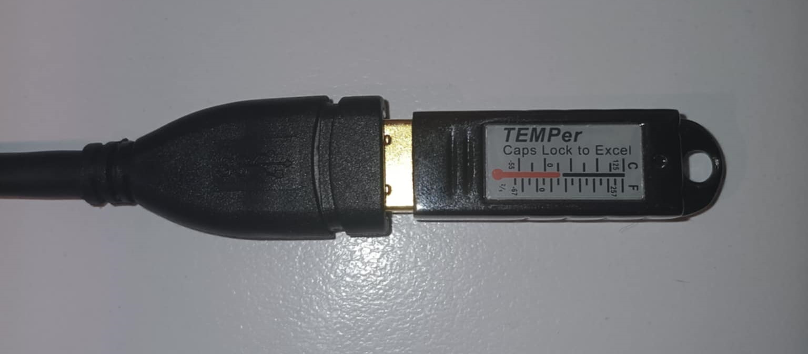

# Redline Temperature Map
Redline is an open source system which can help you monitor and display temperatures of rooms in a multi-floor building in a 3D environment. The project is currently in a working prototype state. The client uses the Godot game engine, and queries a Flask server behind Gunicorn and Nginx (and, in the included server [installation instructions](server/README.md), Cloudflare Tunnel, although that is optional) for temperatures of rooms. The system shows temperature data for a room on a graph when that rooms info point is clicked. The system can report real data from a Raspberry Pi temperature sensor. Future data points could be added, however, for now, temperature is the only supported data point. Here is a video demo of the system: https://www.youtube.com/live/GGxRg7EWbFo. There is currently a Windows and Linux client.
## Development process
The models, Godot client, server, and temperature sensor code were developed entirely solo by me (markipol) over 12 weeks, as my Capstone Project for the La Trobe University Bachelor of Cybersecurity. 
## Models

<picture>
  
</picture>

The model included is of the Jenny Graves Building of the La Trobe University Bundoora campus, split into per floor models and an exterior model. Another model could be used of another building, if the same specific structure is followed. Here is the structure needed inside godot:
```
building
├── rest of building
└── floors
    ├── floor 1
    ├── floor 2
    ├── floor 3
    ├── floor 4
    └── ...etc (can have 1 or more floors, not only 4)
```

"rest of building" and "floor X" are all models imported into Godot. "rest of building" does not need a defined structure, however, "floor X" files do. Here is how "floor X" should look inside Blender:

<picture>
  
</picture>

```
exterior
└── exterior_colonly

interior
└── interior_colonly

plan_col

points
├── 101 - Central Space
├── 101A - HOC Cafe
├── 101B - Male Toilets
├── 101C - Female Toilets
└── ...etc
```

Description of each mesh:
- exterior: exterior walls/windows of the building
  - exterior_colonly: must be child of exterior, collision mesh, make lower poly to not lag. Auto imports StaticBody3D and CollisionShape3D to Godot based on _colonly prefix, doesn't import visible mesh itself.

- interior: interior walls of the building
  - interior_colonly: must be child of exterior, collision mesh, make lower poly to not lag. Auto imports StaticBody3D and CollisionShape3D to Godot based on _colonly prefix, doesn't import visible mesh itself.

- plan_col: simply the bottom surface of the floor, floor plan in the Jenny Graves Building case. Doesn't need seperate collision mesh because it is a simple plane, auto imports StaticBody3D and CollisionShape3D, imports visible mesh.

- points: the parent object of "info points" which are 0.8m cubes the user clicks to show the graph.
  - info points themselves: Must be named "RoomCode - RoomTitle". Godot code splits based on spaces, as long as it has a room code then a space, it will work. The title is not implemented anywhere in and of itself.

  Note: All these nodes must be named this way, the code works on the model having these names.
## Server
The server is a Python Flask server. The [installation instructions](server/README.md) use Nginx and Gunicorn, which is a production-level way to do it, however for testing or development purposes you could use ```flask.run()``` (only one connection at a time, not a fully fledged http/s server, etc). The instructions also mention using Cloudflare Tunnel, however this was only used because La Trobe was blocking the untrusted Azure IP. But in fact, this is a good general security hygiene step as you never expose your real server IP, making it more DDoS resistant. Also, any random network with however many VPNs or filters will only ever connect to a trusted Cloudflare IP, making your connection less likely to be blocked. 
## Client
Please create a file called ".env" with your read key, as added to the server, and put it in the format "READ_KEY = (key)" in the same folder as the EXE, or the root folder if you are opening the project in the Godot editor. ".env" is already in .gitignore, please do not change this. 
## Temperature sensor

<picture>
  
</picture>

The temperature sensor I used for this project was a TEMPerGold attached to a raspberry pi, however any source of data could be used as long as it can send packets to an API. Presumably, as long as you have a laptop/desktop (preferably linux for easy crontab hourly updating) with python and a task scheduler, it would work, however this has not been tested, it was only ever tested on a Raspberry Pi. If using on a rasperry pi, please use on a USB Extender cable or Hub as in the photo, as the heat will make the readings higher than they really are due to the heat of the Pi (laptops depending how hot they get could have this same issue). 
[Amazon link here](https://www.amazon.com.au/dp/B0B6Q236MK?ref=ppx_yo2ov_dt_b_fed_asin_title), not affiliate, but the versions are very sensitive, only this model would work with the provided code. It does not say TEMPer in the attached link, however, trust me, it is. You can see even the TEMPer branding removed poorly in the image on Amazon, presumably this is for legal or copyright reasons.

